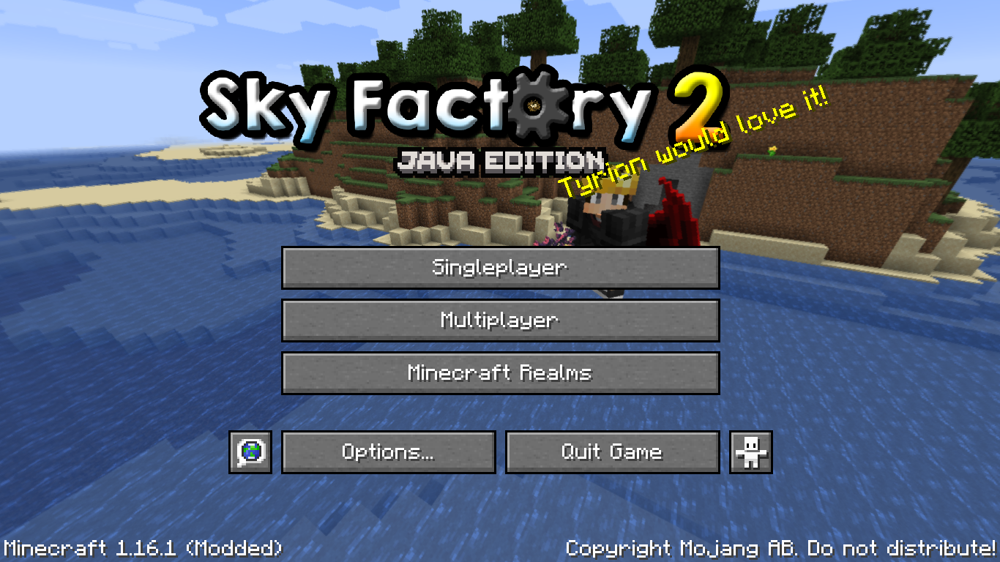
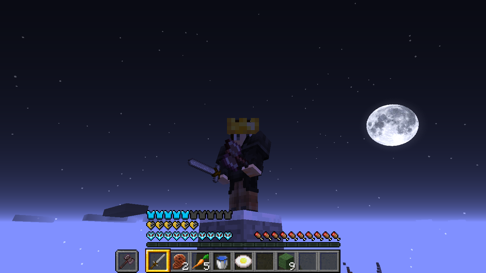
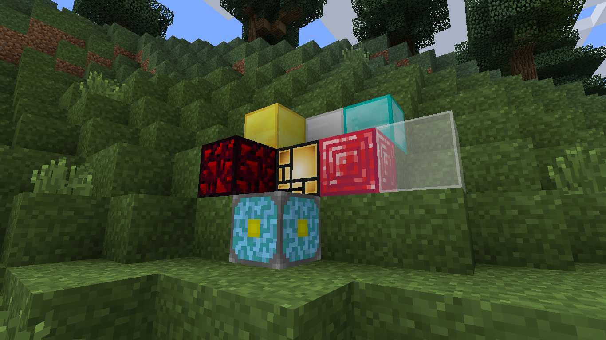
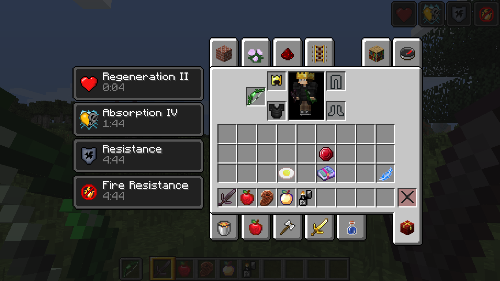
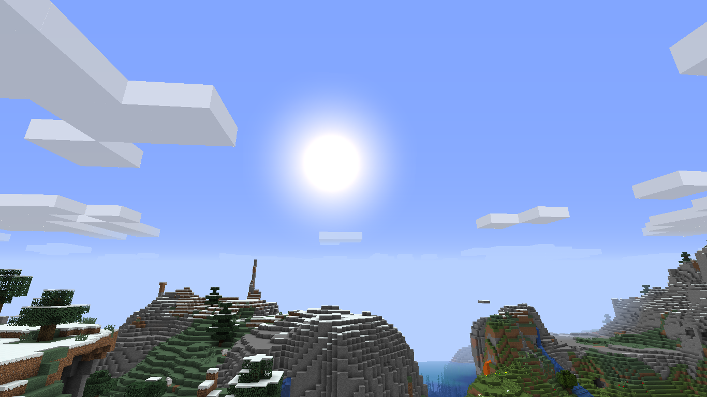
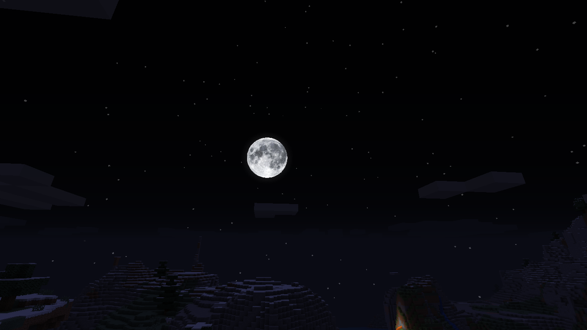
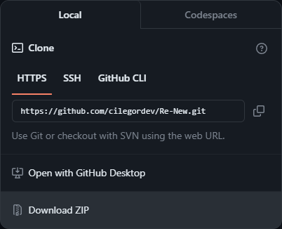
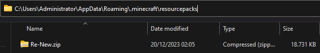

# Re-New
is the default texture given slight changes and animations. </br>
our theme is life in the land of uranus. </br>
work good on 1.16.x but you can try up to 1.19.x

      

# Exsample screenshot

|  MAIN MENU  |
|---------|
|    |

|  SURVIVAL  |
|---------|
|    |

|  BLOCK  |
|---------|
|    |

|  CREATIVE  |
|---------|
|    |

|  DAY  |
|---------|
|    |

|  NIGHT  |
|---------|
|    |

# To apply on Windows




# To apply on Linux
```zsh
git clone https://github.com/cilegordev/Re-New.git ~/Re-New
mv Re-New /home/Administrator/.minecraft/resourcepacks/
```